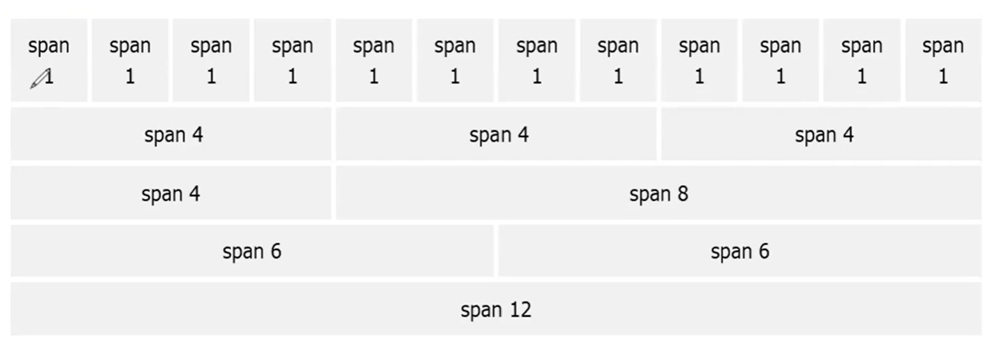

# Bootstrap

- 화면의 배치
- 웹페이지 구성 쉽게 하는 framework
- **반응형 웹** : 화면 사이즈에 따라 웹페이지 구성이 달라짐
    - 다양한 디바이스를 지원(스마트폰, 태블릿)

장점

- 사용이 쉬움
- 반응형 기능
- mobile-first
- 브라우저 호환성

방법

- 링크 추가(CDN)
    - 가까운 서버에서 다운(캐시 로딩) → 굉장히 빠름
- 직접 다운
    1. 다운로드
    2. 메타 태그 정의
        - `<meta name="viewpoint" content="width=device-width, initial-scale=1">`
    3. Container class에 기술
        - `container` : 화면보다 조금 작음
        - `container-fluid` : 화면에 꽉 참
        

## 그리드

- col을 12개로 나눌 수 있음
- 화면의 크기에 대한 클래스 설정